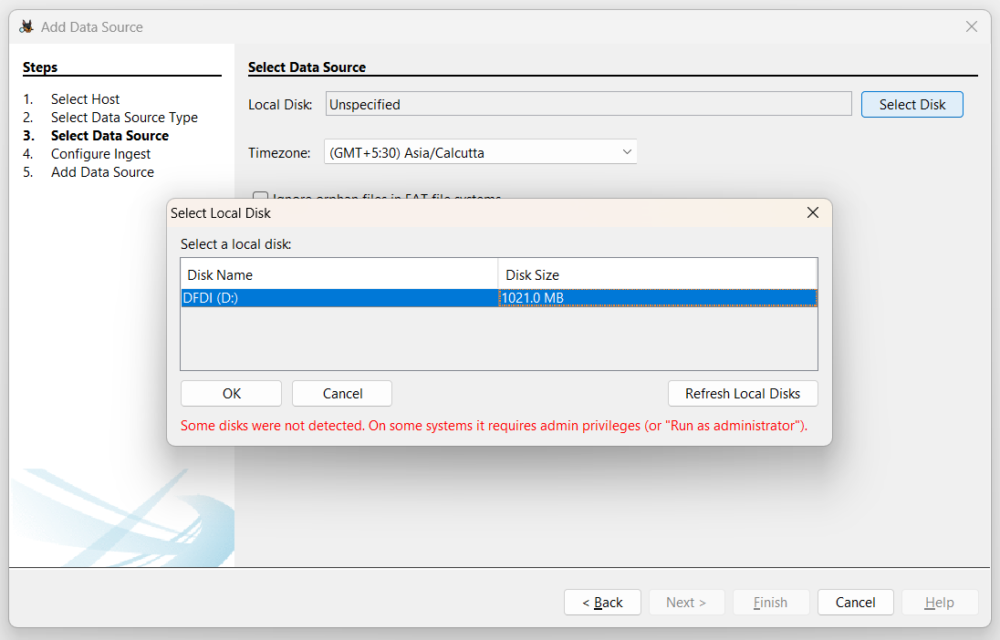
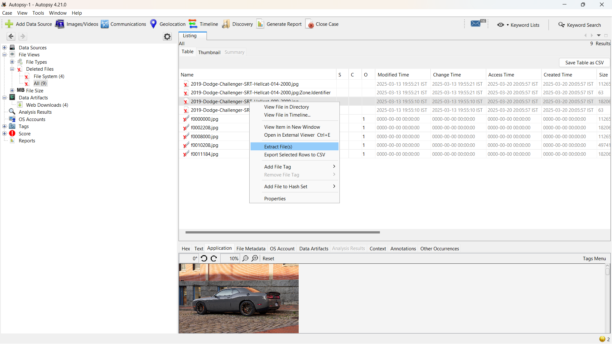
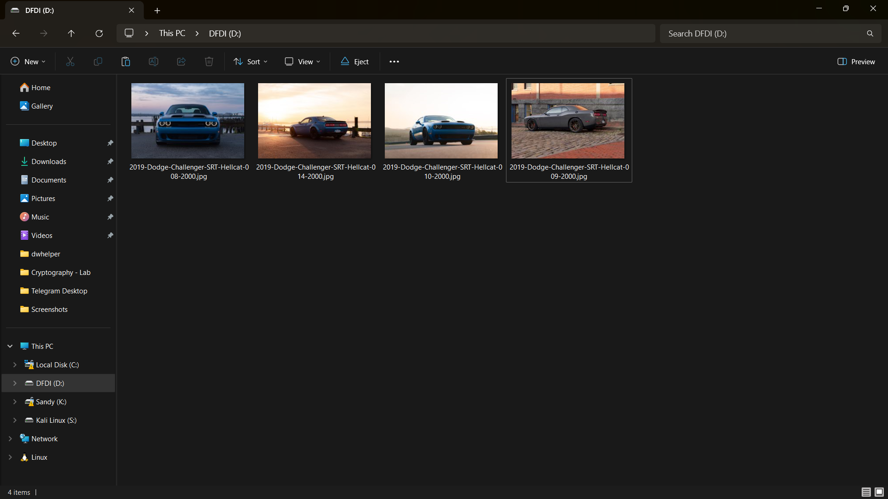
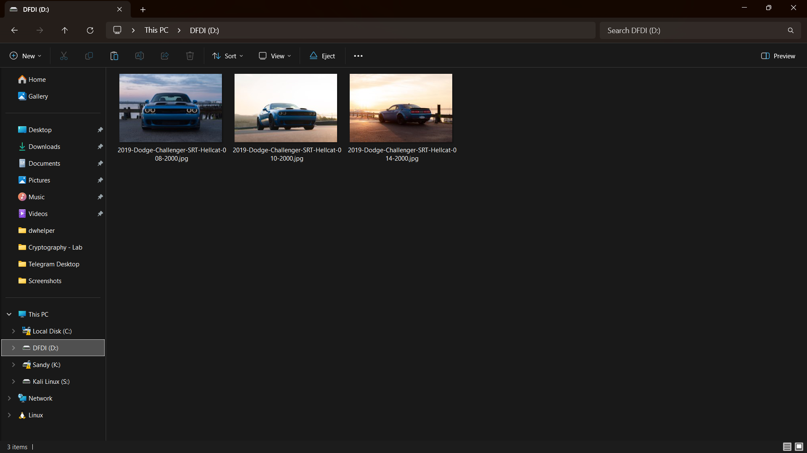
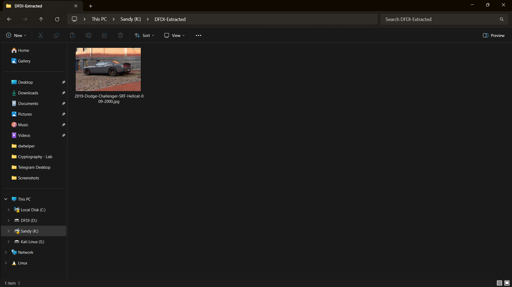

# FILE RECOVERY USING AUTOPSY SOFTWARE

## **Aim:**
Data recovery from unallocated space, using forensic tools(Autospy) to extract and analyze data.

## **Implementation steps:**

### **1. Copy Files to the Virtual Disk**  
- Open **File Explorer** → Go to the new drive (`D:`), where the folder created in the New Virtual Disk
- Create a new folder or use the entire disk and then copy **images or files** into it.  

### **2. Delete the Files**  
- Select any one or two images → Press **Delete**.  
- Empty the **Recycle Bin** to permanently delete them.  

### **3. Recover Deleted Files Using Autopsy**  
### **Open Autopsy & Create a New Case** 

- Launch **Autopsy** and **Run as a administrator**  
- Click **Create New Case**.  

- Enter a **Case Name** (e.g., `Autopsy-1`).  
- Choose a **Case Folder** location.  
- Click **Next** → Click **Finish**.  

### **Add the Virtual Disk as an Evidence Source**  
- Click **Add Data Source**  → **Select Host**

- Select **Local Disk** → **next** 

- Select Disk → **Choose the VHD drive (`DFDI(D:)`)**

- Click **Next** → Keep default settings → Click **Finish**.  
- Wait for Autopsy to process the disk.  

### **Recover Deleted Files**  
- Go to **File Views** (left panel).  

- Click **Deleted Files** → Find your deleted images.  
- Right-click an image → Click **Extract File**.  

- Select a folder to see the recovered files (e.g., `K:\DFDI-Extracted`).  
- Image is recovered successfully.

## Output :
### Folder before deleting the files

### Folder after deleting the files

### Folder after extracting the deleted images using autopsy

## Result:
Successfully extracted the deleted files from unallocated space using the Autospy tool.